<h1 align="center">PLP</h1>
Repositório para salvar códigos de PLP


## 📝 REOs

- [REO 2 - Paradigma Imperativo](#paradigmaimperativo)
- [REO 3 - Paradigma Orientado a Objetos](#paradigmaOrientadoAObjetos)


## <h1><a name = "paradigmaimperativo">🐍 Reo 2 - Paradigma Imperativo</a></h1> 
<!--ts-->
  * [Configurações](#reo2Configurações)
    * [Ambiente virtual](#ambienteVirtualPython)
    * [Extensões para VsCode](#extensoesParaVsCodePython)
    * [settings.json](#settings.jsonPython)
  * [Aulas](#reo2Aulas)
    * [Videoaula de introdução ao Python: GCC198](#aula01)
    * [Paradigma Imperativo : Variáveis e Tipos de Dados](#aula02)
    * [Paradigma Imperativo : Avaliação de Expressões e Controle de Fluxo](#aula03)
    * [Paradigma Imperativo : Subprogramas](#aula04)
  * [Atividade Avaliativa](#reo2AtividadeAvaliativa)
<!--te-->

<a name="reo2Configurações">Configurações</a>
<!--ts-->
  * <a name = "ambienteVirtualPython">Ambiente Virtual</a>
    * Windows
      ```cmd
      py -3 -m venv venv
      //NO VENV
      pip install wheel
      ```
    * Linux e Mac
      ```bash
      python3 -m venv venv
      //NO VENV
      venv/bin/activate 
      pip install wheel
      deactivate
      ```
  * <a name = "extensoesParaVsCodePython">Extensões para VSCode: </a>
    * Code Runner
    * Python ( Microsoft )
    * Python Test Explorer  for Visual Studio Code
    * Python Preview
    * Python Docstring Generator
  * <a name="settings.jsonPython"/>settings.json<a/>
        <p>Na pasta do projeto, crie uma pasta chamada .vscode e dentro dela um arquivo chamado settings.json</p>
    * Windows 
      ```Json
      {
        "python.pythonPath": "venv\\Scripts\\python.exe",
        "code-runner.executorMap": {
          "python": "venv\\Scripts\\python.exe",
        },
        "code-runner.ignoreSelection": true,
        "code-runner.runInTerminal": true,
        "python.linting.mypyEnabled": true,
        "python.linting.flake8Enabled": true,
        "python.testing.unittestEnabled": true,
        "[python]": {
          "editor.formatOnSave": true
        }
      }
      ```
    * Linux
      ```Json
      {
        "python.pythonPath": "venv/bin/python",
        "code-runner.executorMap": {
          "python": "venv/bin/python",
        },
        "code-runner.ignoreSelection": true,
        "code-runner.runInTerminal": true,
        "python.linting.mypyEnabled": true,
        "python.linting.flake8Enabled": true,
        "python.testing.unittestEnabled": true,
        "[python]": {
          "editor.formatOnSave": true
        }
      }
      ```
<!--te-->
   
<a name="reo2Aulas">Aulas</a>
<!--ts-->
  * <b><a name="aula01">Videoaula de introdução ao Python: GCC198</a></b>

    * [Conditionals](#aula01Conditionals)
    * [Interations](#aula01Interations)
    * [Exceptions](#aula01Exceptions)
    * [Files](#aula01Files)
    * [CommandArguments](#aula01CommandArguments)
    * [Extras](#aula01Extras)
    #

    * <b><a name="aula01Conditionals">Conditionals</a></b>

      *  [Vídeo-aula de introdução ao Python : GCC198](https://www.youtube.com/watch?v=zyCu32zRPFw&list=PLhBit65YoreOHcv9evI-uEXJUUeR3wOEM&index=3&ab_channel=ERICKGALANIMAZIERO)

      ```Python
      valor = input("Digite um valor")
      valor = int(valor)
      if ((valor % 2 ) == 0):
        print('Número par')
      else:
        print('Número ímpar')
      ```
      > <p> Digite um número 2 </p>Número par 
      
      ```Python
      valor = int(input("Digite um valor"))
      
      if valor == 0:
        print('Zero!')
      elif valor % 2  == 0:
        print('Número par')
      else:
        print('Número ímpar')
      ```
      > <p> Digite um número 0</p>Zero! 
      
      ```Python
      valor = int(input("Digite um valor"))
      
      msg = 'par' if valor % 2 == 0 else 'ímpar'
      print(msg)
      ```
      > <p>Digite um número 2</p>par

    * <b><a name="aula01Interations">Interations</a></b>

      ```Python
      for i in range(10):
        print(i)
      ```
      >0<p>1<p>2<p>3<p>4<p>5<p>6<p>7<p>8<p>9

      ```Python
      for i in range(5,10):
        print(i)
      ```
      >5<p>6<p>7<p>8<p>9
      
      ```Python
      blacklist = ["palavrão","palavrona","palavreadão"]
      for palavra in blacklist:
        print("Palavra proibida: {}".format(palavra))
      ```
      >Palavra proibida: palavrão<p>Palavra proibida: palavrona<p>Palavra proibida: pavreadão
      
      ```Python
      blacklist = ["palavrão","palavrona","palavreadão"]
      texto = input("Digite uma frase: ")
      palavras = texto.split()
      for palavra in palavras:
        if palavra.lower() in blacklist:
          print("A palavra {} é proibida!".format(palavra))
      ```
      >Digite uma frase: Oi, palavrão tal<p>A palavra palavrão é proibida!
    
    * <b><a names="aula01Exceptions">Exceptions</a></b>

      ```Python
      try:
        valor = int(input("Digite um número"))
        if valor == 0:
          print('Zero!')
        elif valor % 2 == 0:
          print('Número par')
        else:
          print('Número ímpar')
      except:
        print('Valor digitado não é um número!')
      ```
      >Digite um número a<p>Valor digitado não é um número!

    * <b><a name="aula01Files">Files</a></b>
      <p>dataset.csv : 
        <p>7,8,9<p>3,4,5<p>2,4,1<p>90,89,20<p>8,4,12

      ```Python
      xs = []
      ys = []
      zs = []
      with open('dataset.csv','r') as file:
        lines = file.readlines()
        for line in lines:
          x, y, z = line.split(',')
          xs.append(x)
          ys.append(y)
          zs.append(z)
      
      print(xs)
      print(ys)
      print(zs)
      ```
      >['7', '3', '2', '90', '8']<p>['8', '4', '4', '89', '4']<p>['9\n', '5\n', '1\n', '20\n', '12']
      
      ```Python
      xs = []
      ys = []
      zs = []
      with open('dataset.csv','r') as file:
        lines = file.readlines()
        for line in lines:
          x, y, z = line.split(',')
          xs.append(x)
          ys.append(y)
          zs.append(z.strip())
      
      print(xs)
      print(ys)
      print(zs)
      ```
      >['7', '3', '2', '90', '8']<p>['8', '4', '4', '89', '4']<p>['9', '5', '1', '20', '12']

    * <b><a name="aula01CommandArguments">Command Arguments</a></b>
      * python_example1.py 
        
        ```Python
        import sys

        caminho_do_arquivo = sys.argv[1] #o sys.argv[0] é o nome do próprio arquivo python

        xs = []
        ys = []
        zs = []

        with open(caminho_do_arquivo,  'r') as file:
          lines = file.readlines()
          for line in lines:
            x, y, z = line.split(', ')
            xs.append(x)
            ys.append(y)
            zs.append(z.strip())

        print(xs)
        print(ys)
        print(zs)
        ```
      * A chamada é feita por terminal de comando<p>python3 python_example1.py dataset.csv
        >['7', '3', '2', '90', '8']<p>['8', '4', '4', '89', '4']<p>['9', '5', '1', '20', '12']

    * <b><a name="aula01Extras">Extras</a></b>
    
      ```Python
      numeros = [1, 10, 100, 1000, 2, 20, 200]
      print(sum(numeros))
      print(max(numeros))
      print(min(numeros))
      ```
      >1333<p>1000<p>1

      
      ```Python
      numeros = [1, 10, 100, 1000, 2, 20, 200]
      print("Média da lista", sum(numeros)/len(numeros))
      ```
      >190.42857142857142


  * <b><a name="aula02">Paradigma Imperativo : Variáveis e Tipos de Dados</a></b>
  
      *  [Vídeo-aula Paradigma Imperativo : Variáveis e Tipos de Dados](https://www.youtube.com/watch?v=ixgq1igka04&list=PLhBit65YoreOHcv9evI-uEXJUUeR3wOEM&index=4&ab_channel=ERICKGALANIMAZIERO)
      * [Slide Variáveis e tipos de dados](https://drive.google.com/file/d/16eCZZyFb7y4OKCbyoKi-tf8mOBlD2284/view?usp=sharing)

      ```Python
      my_string = 'Hello, World!'
      my_flt = 45.06
      my_bool = 5 > 9
      my_list = ['item1','item2']
      my_tuple = ('item1','item2')
      my_dict = {'letter':'g','number':7}
      ```

  * <b><a name="aula03">Paradigma Imperativo : Avaliação de Expressões e Controle de Fluxo</a></b>
  
      *  [Paradigma Imperativo : Avaliação de Expressões e Controle de Fluxo](https://www.youtube.com/watch?v=SXqOHgvQBfo&list=PLhBit65YoreOHcv9evI-uEXJUUeR3wOEM&index=5&ab_channel=ERICKGALANIMAZIERO)
      
      * [Avaliações de expressões e controle de fluxo](https://drive.google.com/file/d/1_ohN2hIh6nSqq-Pyl2W7fvFvajyrUAhW/view?usp=sharing)

  * <b><a name="aula04">Paradigma Imperativo : Subprogramas</a></b>

      *  [Paradigma Imperativo : Subprogramas](https://www.youtube.com/watch?v=IBVEJx5Hfzo&list=PLhBit65YoreOHcv9evI-uEXJUUeR3wOEM&index=6&ab_channel=ERICKGALANIMAZIERO)
      
      * [Subprogramas](https://drive.google.com/file/d/1SuvBqQdD7KhYc7GiGW8z6nM0ef3hLZcL/view?usp=sharing)

      ```Python
      def subprograma(a,b,c):
        print(a + b + c)
      ```
      * Recursao
        
      ```Python
      def fatorial(n):
        if (n <= 1):
          return 1
        else: 
          return (n * fatorial(n-1))
      ```
<!--te-->
<a name="reo2AtividadeAvaliativa">Atividade Avaliativa</a>
<!--ts-->
  * Sobre
    * Programa pra rodar o coeficiente da correlação de Pearson
  * Rodar
  
      ```cmd
      py -3 atividade_avaliativa_Rafael_Porto_reo2 teste.txt
      ```
<!--te-->

# <a name="paradigmaOrientadoAObjetos"></a> 🐍 Reo 3 - Paradigma Orientado a Objetos

* ### Aulas
  * #### [Paradigma Orientado a Objetos : Conceitos iniciais](#reo3aula1)
  * #### [Paradigma Orientado a Objetos : Encapsulamento](#reo3aula2)
  * #### [Paradigma Orientado a Objetos : Herança e Composição](#reo3aula3)
  * #### [Paradigma Orientado a Objetos : Polimorfismo](#reo3aula4)

* ### [Python](#reo3Python)

* ### [Atividade Avaliativa](#reo3atividadeAvaliativa)


## <a name="reo3aula1"></a> **Paradigma Orientado a Objetos : Conceitos iniciais**


[Video Aula](https://youtu.be/lIp_sSmD3hg)

### **Conjunto de princípios**
 * Orientam a criação de sistemas computacionais, objetos que interagem entre si.  

Em termos de LPs, conceitos formais surgem com Simula 67, sendo consolidados com Smalltalk (primeira linguagem orientada a objetos).  

Popularizado com a difusão de interfaces gráficas de usuários (GUIs)
 * Surgimento de ferramentas com suporte para desenvolvimento de aplicações gráficas (C++, FoxPro, Delphi). 

Suportado por várias linguagens (ex: Python, Ruby, C#)
 * Atualmente sua maior expressão comercial é dada pelo Java

### **Pilares da OO**

Conceitos fundamentais (pilares) que norteiam o desenvolvimento OO:
 * Abstração;
 * Encapsulamento;
 * Herança;
 * Polimorfismo.

### **Abstração**
Representação de uma entidade do mundo real, com seu comportamento e características.  
"Modelos Mentais"
 * Classes;
 * Objetos;
 * Métodos;
 * Atributos;

**Classes**: 
Uma classe pode ser entendida como um módulo ou uma estrutura de dados abstrata.  
Uma visão mais ampla pode levar à seguinte definição:  
 * Uma classe é um tipo abstrato de dados, que reúne objetos com características similares.
 * O comportamento destes objetos é descrito pelo conjunto de métodos disponíveis.
 * O conjunto de atributos da classe descrevem as características de um objeto.

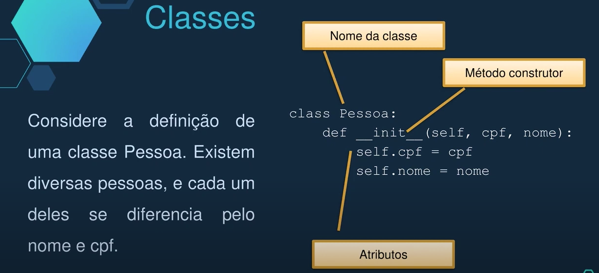

**********

**Objetos**:  
Um objeto pode ser entendido como um ser, lugar, evento, coisa ou conceito do mundo real que possa ser aplicável a um sistema.  
É comum que haja objetos diferentes com características semelhantes. Esses objetos são agrupados em classes.  
Classes são um agrupamento de objetos com características similares!  
Objetos são entidades (instâncias) únicas de uma classe!


************

**Atributos**:  
Um atributo é uma característica de um grupo de entidades do mundo real, agrupados em uma classe.  
Um atributo pode ser um valor simples (um inteiro, por exemplo) ou estruturas complexas (um outro objeto, por exemplo).  

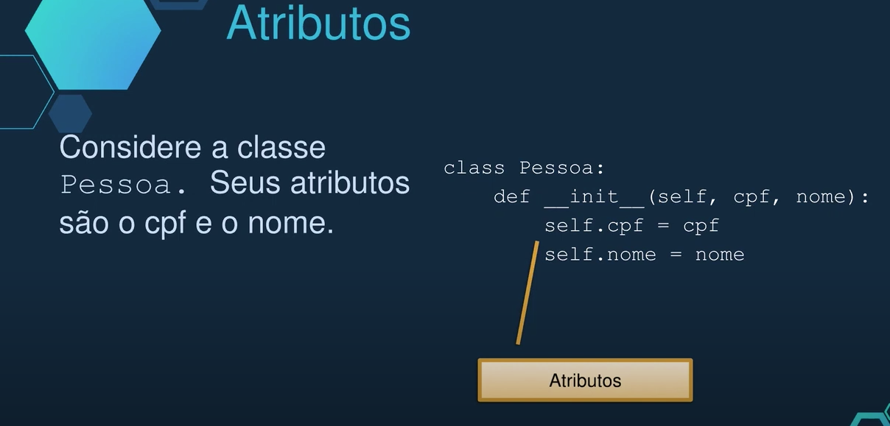

Atributos de classe  
 * Em geral, os atributos pertencem a cada objeto instanciado, ou seja, a cada novo instanciação de uma mesma classe, cada instância pode ter valores distintos para cada atributo.
 * Atributos de classe são definidos para terem o mesmo valor para todas as instâncias de uma classe.

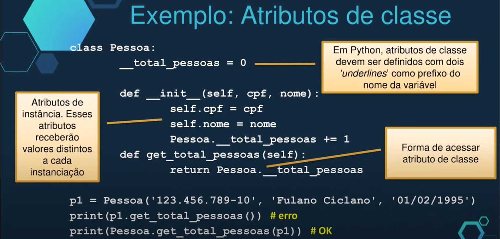

***************

**Métodos**  
Semelhante a uma função, é a implementação de uma ação da entidade representada pela classe;  
Conjunto de métodos define o comportamento dos objetos de uma classe.  

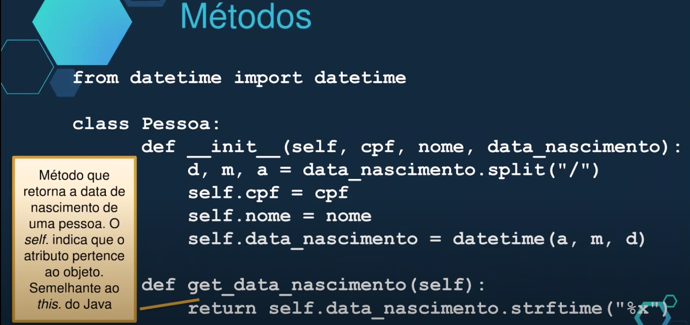

******************

**Construtores**  
É um método especial para a criação e inicialização de uma nova instância de uma classe.  
Um construtor inicializa um objeto e suas variáveis, cria quaisquer outros objetos de que ele precise, garantindo que ele seja configurado corretamente quando criado.  
Na maioria das LPs, o construtor é um método que tem o mesmo nome da classe, que geralmente é chamado quando um objeto da classe é declarado ou instanciado.  

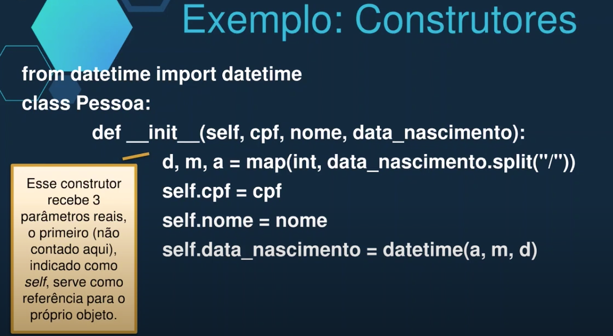
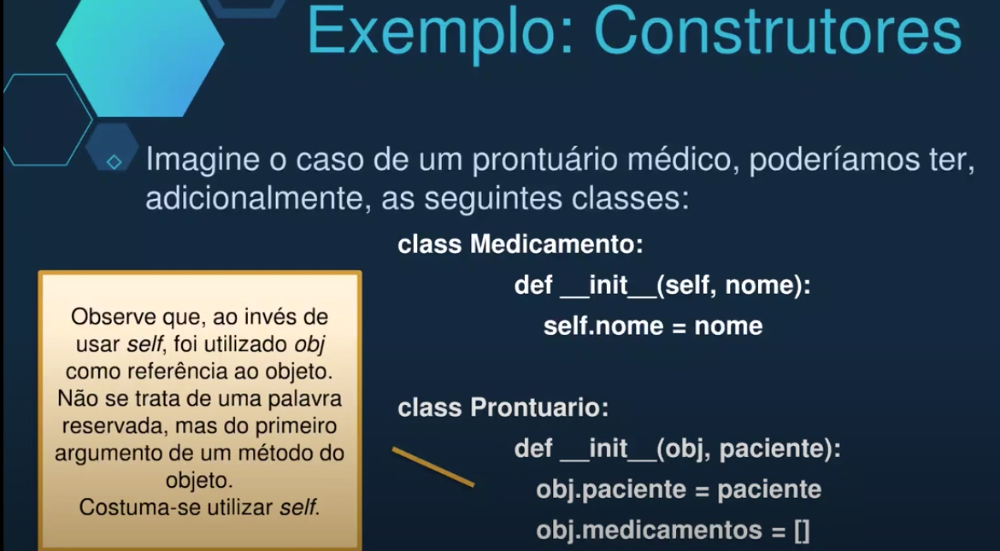

****************

**Destrutores**  
De forma similar aos construtores, os destrutores são métodos fundamentais das classes, sendo geralmente chamados quando termina o tempo de vida do objeto.  
Em algumas linguagens como C++, ocupam um papel tão importante quanto os construtores, por conta da necessidade de desalocação de memória.  
Em outras linguagens como Java, o Garbage Collector (Coletor Automático de Lixo) faz esse papel, desalocando aquilo que não é mais utilizado. Há o método `finalize()`, mas raramente é utilizado (há dúvidas se sempre funciona, inclusive).  
Tanto os construtores, quanto os destrutores são métodos que não precisam ser definidos em Orientação a Objetos em Python, caso o comportamento esperado seja o padrão.  
Geralmente, define-se o construtor para a passagem de argumentos na criação do objeto. Já o destrutor não se costuma definir.  
Caso seja necessário realizar algum procedimento na destruição do objeto, define-se o método destrutor, como será exemplificado.  

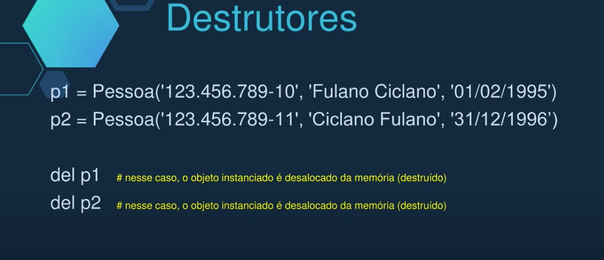
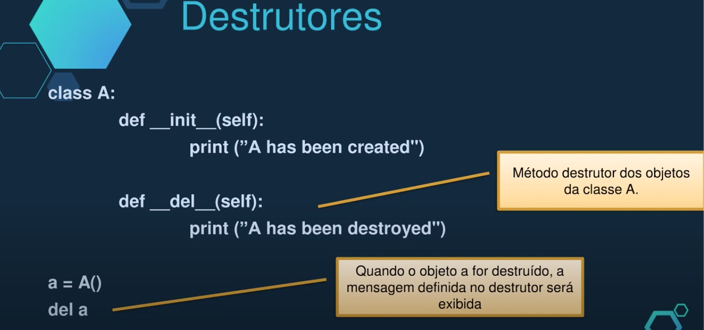

Garbage Collection em Java  
 * Em C++ a memória é alocada e desalocada explicitamente
 * Java possui gerenciamento automático de memória, realizado pela JVM  
   * Evita vazamento de memória e bugs de ponteiros 
   * Consome recursos computacionais quanto à decisão de desalocação
   * É um processo "não determinístico"

****

## <a name="reo3aula2"></a> **Paradigma Orientado a Objetos : Encapsulamento**  
[Video Aula](https://youtu.be/thvtKowe85E)  

Na programação Orientada a Objetos, é desejável e, muitas vezes, muito importante, que os atributos dos objetos tenham o devido nível e forma de acesso externo ao objeto.  
Para isso, é necessário definir a visibilidade dos atributos e métodos de um objeto.  
Como 'dono' dos atributos, um objeto é o mais indicado para lidar com seus atributos e métodos e não o cenário externo, como outros objetos.  
O encapsulamento permite maior controle e validação dos dados de um objeto  

### Encapsulamento  
É importante evitar que atributos de uma classe sejam diretamente acessíveis de fora da classe.
```Python 
class Conta:
  def __init__(self):
    self.saldo = 0

c1 = Conta()
c1.saldo = 100000
```  

Para acessar esses atributos, métodos são definidos   
  * permitem maior controle dos valores, como validação dos dados

### **Visibilidade**  
A visibilidade é utilizada para indicar o nível de acesso de um determinado atributo ou método;  
Os três modos distintos são:  
  * Público:
    * Objetos de quaisquer classes podem ter acesso a atributos, ou métodos, públicos;
  * Privado:
    * Apenas a classe que define atributos ou métodos privados pode ter acesso a eles;
  * Protegido:
    * Apenas a classe e suas subclasses podem ter acesso a atributos e métodos protegidos;

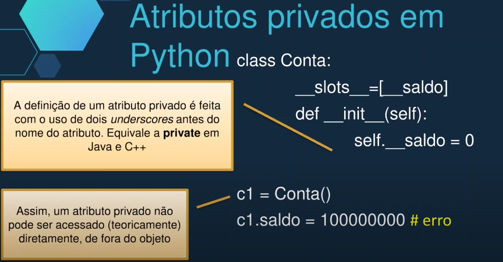
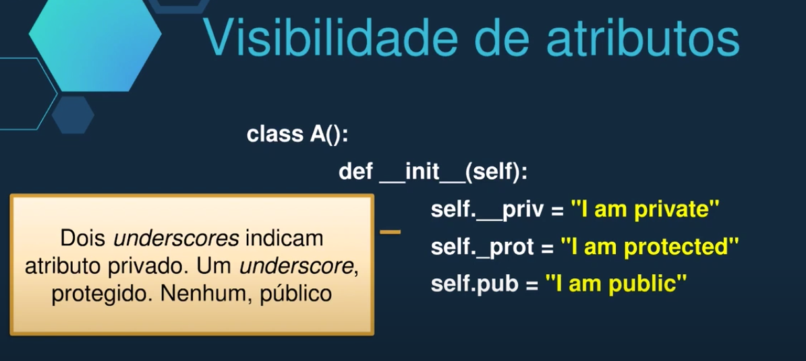

Em Python é possível definir atributos, no momento da execução: 
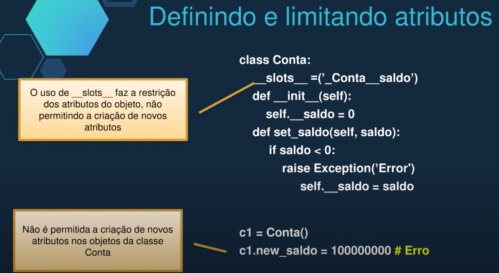
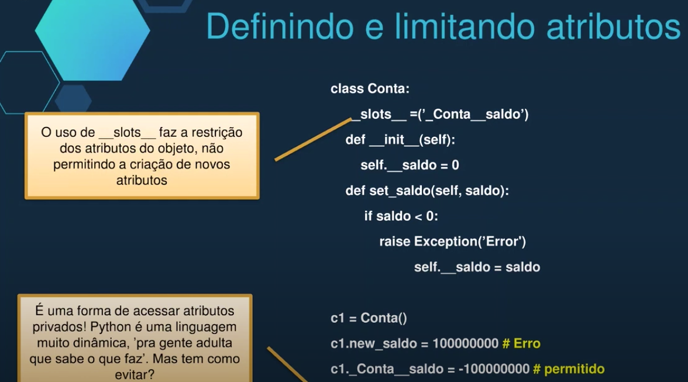

### **Getters e Setters**  
São métodos específicos para acesso aos atributos de uma classe, principalmente os atributos privado.  
Como padrão na comunidade de programadores, são nomeados com os prefixos 'ser_' ou 'get_' para ajustar ou obter os valores dos atributos.  
Permitem validação e formatação dos valores dos atributos antes de serem acessados ou alterados fora do objeto.  
São métodos, geralmente, públicos  

### **Troca de Mensagens**  
Na Orientação a Objetos, os objetos interagem pela troca de mensagens, e, nesse contexto, os métodos getters e setters desempenham papel importante e frequente. 
<h3 align="center"><em>Cada objeto sabe os atributos que têm e, portanto, têm métodos para alterá-los adequadamente</em></h3>  

### **Padrões de Projeto de Software**
Sáo soluções gerai para problemas que ocorrem com frequência na programação.  
Um desses padrões é chamado *'Decorator'*
  * Esse padrão adiciona comportamento a um método ou objeto em tempo de execução.

No python: 
**Decorators** @property e @attr.setter  
**@property** decora os métodos getters  
**@attribute_name.setter**, os métodos setters  
Não se utiliza os prefixos 'get_' e 'set_'  
Os métodos têm o nome do atributo a ser manipulado   
  * Polimorfismo

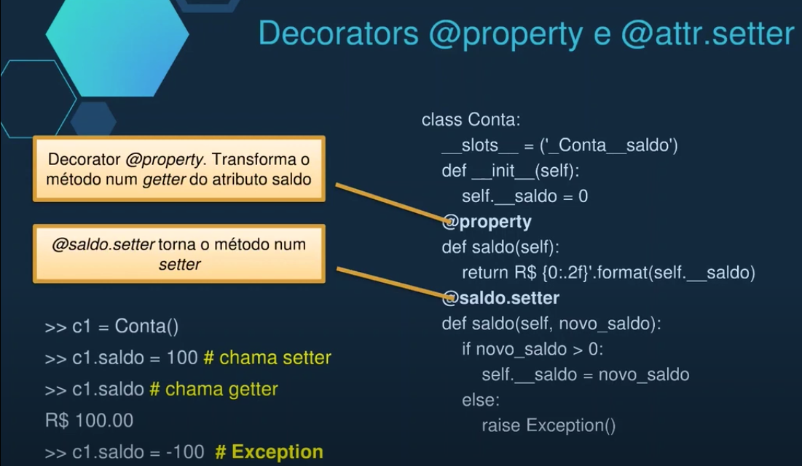

**Decorator**  
**@classmethod** define métodos de classe  
@classmethod recebe uma referência à classe (geralmente chamado de cls) como primeiro parâmetro implícito (semelhante ao self, referência ao objeto)  

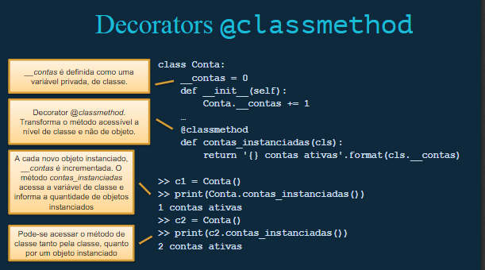


****

## <a name="reo3aula3"></a> **Paradigma Orientado a Objetos : Herança e Composição**

### **HERANÇA OO**  
Mecanismo que permite que características comuns a diversas classes sejam organizadas em uma classe base e que, a partir dessa, outras possam ser criadas, herdando a classe base. 
<div align="center">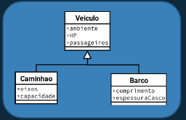</div>  

A classe derivada (ou subclasse) mantém as características herdadas e acrescenta o que for de sua exclusividade. 
<div align="center">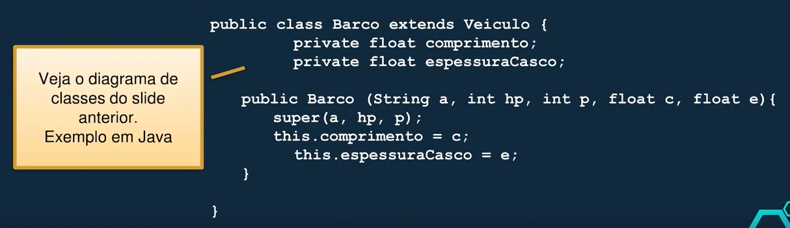</div>

A classe derivada (ou subclasse) mantém as características herdadas e acrescenta o que for de sua exclusividade.  
<p align="center">Python</p>

```Python 
class Pessoa: 
  def__init__(self,nome):
    self.nome = nome
  
class Paciente(Pessoa):
  def __init__(self,nome, med_id):
    super().__init__(nome)
    self.med_id = med_id

class Medico(Pessoa):
  def __init__(self,nome,id_func):
    super().__init__(nome)
    self.id_func = id_func
```
<div align="center">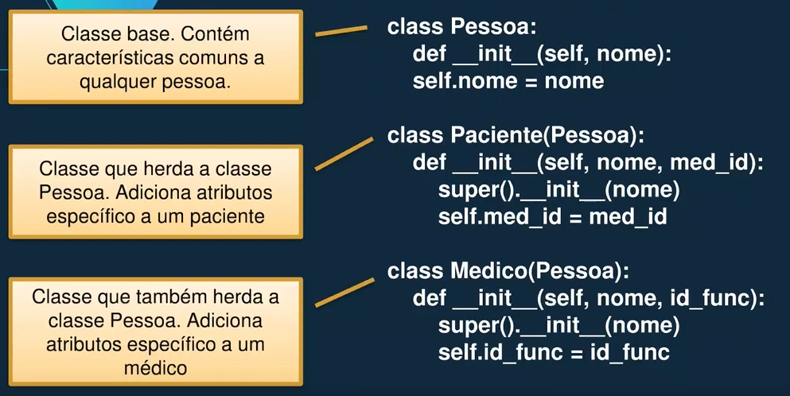</div>

### **CLASSE ABSTRATA**
Uma classe abstrata contém métodos abstratos, ou seja, que não têm implementação  
As classes que herdarem a classe abstrata são obrigados a realizar a implementação dos métodos abstratos da classe abstrata  
Uma classe abstrata, com métodos abstratos não pode ser diretamente instanciada  
<div align="center">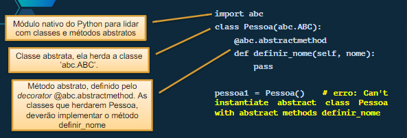</div>
<div align="center">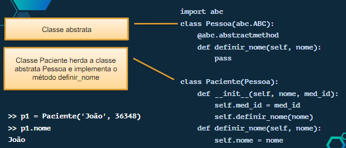</div>

### **DUCK TYPING**  
Estilo de codificação, em linguagens dinamicamente tipadas, em que define-se classes e métodos sem se importar com o tipo das variáveis.  
<p align="center">Importa-se com o comportamento, não com o tipo</p>
<p align="center">se anda como pato, nada como um pato e faz quack como um pato, então provavelmente é um pato</p>

Por ser uma linguagem não tipada, ou seja, não se define o tipo das variáveis, os argumentos de métodos não são tipados e podem receber qualquer tipo de dados.   
Obviamente, as expressão com tais argumentos devem envolver operadores que consigam lidar com os valores fornecidos.  
Para se certificar que uma variável é um tipo esperado, o Python fornece algumas funções úteis: 
  * **type()** recebe como parâmetro uma variável e retorna o tipo da mesma
  * **isinstance()** recebe dois parâmetros: variável e tipo esperado. Retorna True se a variável é do tipo indicado e False caso contrário

```Python
class A: 
  pass

>> a = A()

>> isinstance(a,A)
True

>> type(a)
<class '__main__.A'>
```

### **HERANÇA MÚLTIPLA**  
Uma classe pode herdar de mais de uma classe seus atributos e métodos  
Java não suporta  
C++ e Python suportam herança múltipla  

<div align="center">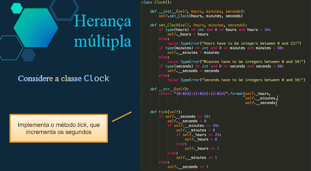</div>
<div align="center"></div>
<div align="center">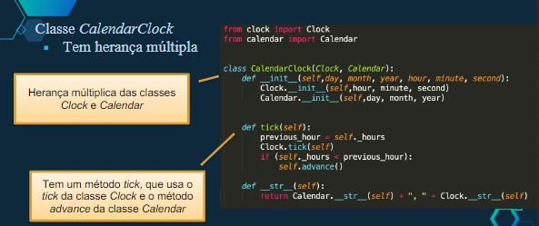</div>


### **PROBLEMA DO DIAMANTE**  
O problema do Diamante (devido à forma geométrica da ilustração ao lado) pode ocorrer na herança múltipla  

```Python  
class A:
  def m(self):
    print("m of A called")
class B(A):
  def m(self):
    print("m of B called")
class C(A): 
  def m(self):
    print("m of C called")

class D(B,C):
  pass
```

Considere as classes A, B, C e D, a cima, o que acontece no seguinte trecho do código? 
```Python
d = D()
d.m()
```
<span style="color: orange;">Qual método m() será invocado, da classe A,B ou C?</span>   
A resolução da ambiguidade depende da MRO (MethodResolutionOrder) de cada linguagem  
Leia em https://www.python.org/download/releases/2.3/mro/ADBC


****

## <a name="reo3aula4"></a> **Paradigma Orientado a Objetos : Polimorfismo**

****

## <a name="reo3Python"></a> **Paradigma Orientado a Objetos : Python**

Conceitos Iniciais: 

Definição de classe:   
```Python
class Pessoa: 
  def __init__(self,cpf,nome): 
    self.cpf = cpf
    self.nome = nome
```
Objetos: 
```Python
p1 = Pessoa('123.456.789-10', 'João da Silva')
```
Atributos são o `self.cpf` e `self.nome`  
Atributos de classe nesse exemplo seria o `__total_pessoas`  
```Python
class Pessoa: 
  __total_pessoas = 0
  def __init__(self,cpf,nome): 
    self.cpf = cpf
    self.nome = nome
    Pessoa.__total_pessoas += 1
  def get_total_pessoas(self): 
    return Pessoa.__total_pessoas

p1 = Pessoa('123.456.789-10', 'Bissexto')
print(p1.get_total_pessoas()) #erro
print(Pessoa.get_total_pessoas(p1)) #OK
``` 
> 1  

Métodos
```Python
from datetime import datetime
class Pessoa:
  def __init__(self,cpf,nome, data_nascimento):
    d, m, a = data_nascimento.split("/")
    self.cpf = cpf
    self.nome = nome
    self.data_nascimento = datetime(a,m,d)

  def get_data_nascimento(self):
    return self.data_nascimento.strftime("%x")
```
Construtores 
```Python
class Medicamento:
  def __init__(self, nome):
    self.nome = nome
```
Destrutores  
```Python
class A: 
  def __del__(self):
    print("A has been destroyed")

minhaClasse = A()
del minhaClasse
```
> A has been destroyed


Visibilidade de atributos 
```Python
class A(): 
  def__init__(self):
    self.__priv = "I am private"
    self._prot = "I am protected"
    self.pub = "I am public"
```

Limitanto os atributos 
```Python
class Conta:
  _slots__=('_Conta__saldo')
  def __init__(self): 
    self.__saldo = 0 

c1 = Conta()
c1.new_saldo = 100000 #Erro
c1._Conta__saldo = 100000 #permitido
```
Decorators 
```Python
class Conta: 
  _slots__ = ('_Conta__saldo')
  def __init__(self): 
    self.__saldo = 0  
  @property  
  def saldo(self):
    return 'R$ {0:.2f}'.format(self.__saldo)
  @saldo.setter 
  def saldo(self, novo_saldo):
    if novo_saldo > 0:
      self.__saldo = novo_saldo
    else:
      raise Exception()
  @classmethod 
  def contas_instanciadas(cls):
    return '{} contas ativas'.format(cls.__contas)

c1 = Conta()
c1.saldo = 100 # chama setter  
c1.saldo  # chama getter
# R$ 100     
c1.saldo = -100 #Exception
print(Conta.contas_instanciadas()) 
c2 = Conta()
print(c2.contas_instanciadas()) 
```
> 1 contas ativas  
> 2 contas ativas   

Herança em OO  
```Python 
class Pessoa: 
  def__init__(self,nome):
    self.nome = nome
  
class Paciente(Pessoa):
  def __init__(self,nome, med_id):
    super().__init__(nome)
    self.med_id = med_id

class Medico(Pessoa):
  def __init__(self,nome,id_func):
    super().__init__(nome)
    self.id_func = id_func
```
